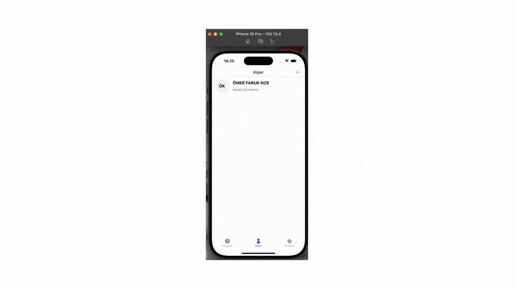

# REACT-NATIVE-SQLITE-CALL-WORK

<h4>

📱 Kişi Rehberi Uygulaması – React Native & SQLite
Bu projede, mobil cihazlar için basit ve kullanışlı bir kişi rehberi uygulaması geliştirdim. Uygulama, kişilerin eklenmesi, listelenmesi ve saklanması gibi temel işlevleri sunmaktadır.

🔧 Kullanılan Teknolojiler:
React Native

SQLite (react-native-sqlite-storage)

Formik & Yup (Form yönetimi ve validasyon)

React Navigation (Sayfa geçişleri)

UI Kitten (Şık arayüz bileşenleri)

🚀 Uygulama Özellikleri:
📇 Kişi Ekleme:
Kullanıcı, ad-soyad, telefon, e-posta ve meslek gibi alanları doldurarak yeni bir kişi kaydedebilir.

📥 Veri Saklama (SQLite):
Kişiler cihaz içinde kalıcı olarak SQLite veritabanında saklanır.

📄 Kişi Listesi:
Eklenen kişiler alfabetik olarak listelenir. Her kişi için ad soyad baş harflerinden oluşan avatar gösterilir.

➕ Kullanıcı Dostu Arayüz:
UI Kitten bileşenleri ile sade ve modern bir tasarım sağlanmıştır.

🔄 Gerçek Zamanlı Güncelleme:
Yeni kişi eklendiğinde liste otomatik olarak güncellenir.

📱 iOS ve Android uyumlu yapı.

📌 Neden SQLite?
Yerel veritabanı olarak SQLite seçilmesinin sebebi:

İnternetsiz kullanım desteği

Kalıcı veri saklama ihtiyacı

Hızlı ve hafif performans

</h4>

<h5>Gif Dosyası : </h5>

